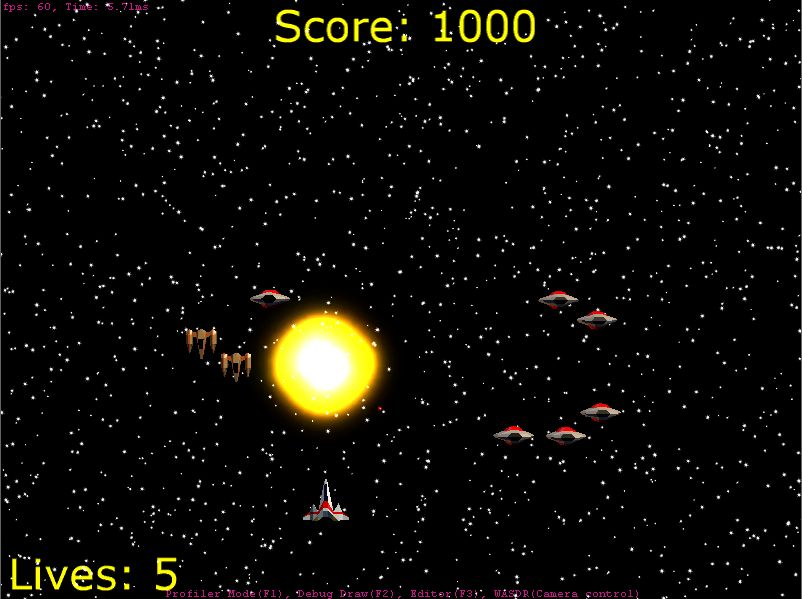
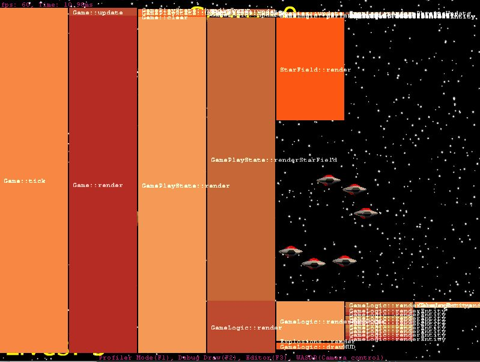
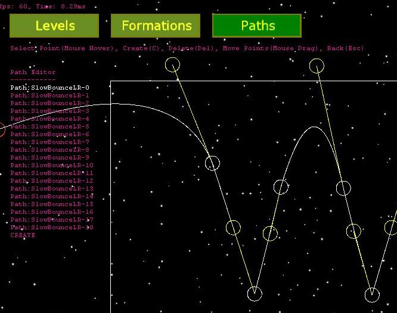

# dx11-space-shooter
</img>

DirectX 11 project using DirectXTK to make a space shooter game.

## Keyboard Controls:
Arrow Keys: Movement
CTRL/Spacebar: Fire

## Features:
+ In-game profiler (F1)
+ Debug drawing (F2)
+ In-game editor (F3)
+ In-game parameters editing via Midi-Controller

## Profiler
</img>

Press F1 to cycle through Profiler Modes
+ Ordered function times
+ Flame-graph of the call stack (Left-click on function to drill-down. Right-click resets to root function)

## Editor
</img>

Press F3 to enter the editor.
Cycle through Editors available with the TAB key or click on the menu box
+ Levels: create a list of times enemies should spawn and in which formation
+ Formations: create a set of enemy configurations, which can be refered to in the level editor
+ Paths: bezier curves used to define the movement of enemies. Used when creating a formation.

## Midi-Controller support
When a midi-controller is detected on startup it can be used to edit physics values in realtime.
Current values are shown with Debug Drawing enabled (F2)
Midi-Mapping is:
+ Camera Distance (channel 16)
+ Player Speed (channel 17)
+ Player Friction (channel 18)
+ Player Max Velocity (channel 19)
+ Player Min Velocity (channel 20)

## Status:
+ Editor is missing bezier path editor and load/save functionality.
+ Only small hard-coded development level exists in game.
+ Joypad support to be added

## Building:
Recommended for building: (although should still build after retargetting these in VS)
+ Windows SDK 10.0.16299.0
+ Platform Toolset v141

(Tested on VS 2017 Community Edition with Windows 10 Fall Creators Update)
